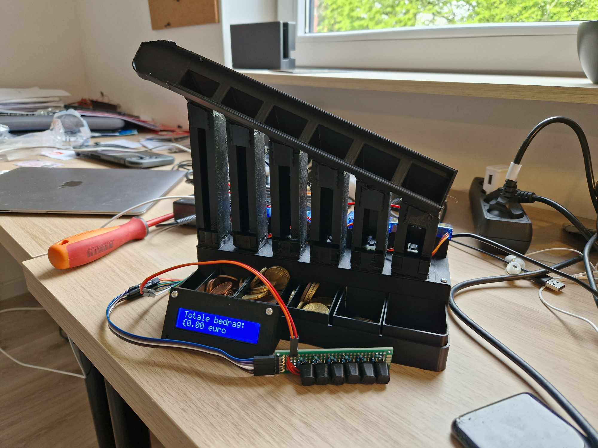

<!-- PROJECT LOGO -->
 

  

  <h3 align="center">Coin sorting and storage system</h3>

  

    A coin-counting, storing, and dispensing system.
     
    <a href="https://giptiebedeclercq.wordpress.com/"><strong>View the blog »</strong></a>
     
     
  

<!-- ABOUT THE PROJECT -->
## About The Project

My design is a coin sorting and storage system aimed at effectively addressing the issue of loose change in the household. By storing all your coins in one central location, all the inconveniences of scattered small change are eliminated, and you have an accurate overview of your available loose change at all times. In this document, I will meticulously walk through the various phases of the project, detailing the development and implementation of the coin sorting and storage system step by step. All necessary information, including components and diagrams, is included in my document, accompanied by comprehensive explanations for a clear overview of the entire process.

## Download the software
This is the general software to control the coinsorting system for simply storing you're coins

  <a href="https://play.google.com/store/apps/details?id=com.Ti3b3.Coin_sorting_and_storage_system"></img></a>
  <a href="https://l.messenger.com/l.php?u=http%3A%2F%2Fitunes.apple.com%2Fapp%2Fid6480136312&h=AT0W5dLV4-_HWo6Hpzhd1CNAs4ooRaiCPJcBq9KRZzaV246Ko3VcdnYeWSVa93cHaYDz-uc7uD9_STlt7n5DoX44x320C2RBlRl9Fa9wpZAEIEF3_ePi8t-rp98hANBxP2WmDY1l13mO-Vc"></img></a>
  <a href="https://apps.microsoft.com/detail/9ndc85wl55n7?hl=nl-nl&gl=BE"></img></a>

This is sofware/game to play flappy bird but you can play with multiple people and compete against eatchother 

<a href="https://ti3b3.itch.io/coin-sorting-and-storage-system-flappy-bird"></img></a>

(<a href="#readme-top">back to top</a>)

